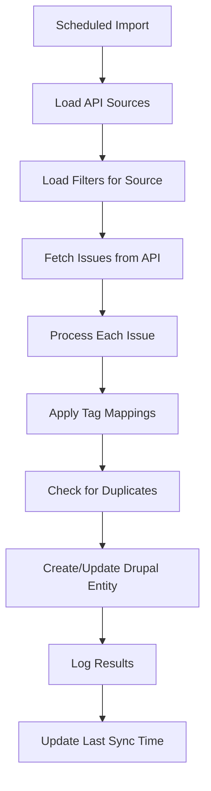

# AI Dashboard Module - Technical Documentation

## Table of Contents
1. [Overview](#overview)
2. [Assignment Record System](#assignment-record-system)
3. [Current Implementation](#current-implementation)
4. [System Architecture](#system-architecture)
5. [Content Types & Data Structure](#content-types--data-structure)
6. [Assignment Management](#assignment-management)
7. [Drush Commands](#drush-commands)
8. [Dashboard Views & Controllers](#dashboard-views--controllers)
9. [API Integration](#api-integration)
10. [Installation & Configuration](#installation--configuration)
11. [Development & Extensibility](#development--extensibility)

## Overview

The AI Dashboard module provides a comprehensive project management system for tracking AI-related contributions, issues, and resource allocation in Drupal. It features a sophisticated assignment tracking system that maintains complete history of who worked on which issues during specific weeks.

**Key Features:**
- Multi-company contributor tracking
- **Week-based assignment history system** (NEW)
- Issue management with structured categorization
- Calendar-based resource allocation views with historical transparency
- Flexible tag mapping from external sources
- Administrative interfaces with filtering
- CSV import system for bulk contributor management
- API import system with intelligent assignment tracking
- Complete Drush command integration
- Auto-creation of modules during import process

## Assignment Record System (NEW - January 2025)

### Core Concept
The AI Dashboard now uses a sophisticated **AssignmentRecord** entity system that tracks WHO was assigned to WHICH issue during WHICH specific week. This replaces the previous field-based assignment system with a robust, history-preserving approach.

### Key Benefits
- **Week-specific assignments**: Each assignment is tied to a specific week (YYYYWW format)
- **Complete history preservation**: See who worked on what issue during which exact weeks
- **Transparent calendar view**: Historical assignments show with transparency effects
- **Source tracking**: Know how assignments were created (sync, drag/drop, manual, etc.)
- **Status snapshots**: Preserve issue status at the time of assignment
- **No data loss**: Assignment changes only affect the current week

### AssignmentRecord Entity Structure
```php
- issue_id (Entity Reference → AI Issue)
- assignee_id (Entity Reference → AI Contributor) 
- week_id (Integer) // YYYYWW format (e.g., 202533)
- week_date (Date) // Monday of assignment week (for display)
- issue_status_at_assignment (String) // Issue status when assigned
- assigned_date (Timestamp) // When assignment record was created
- source (List) // How assignment was created:
  - manual
  - drupal_org_sync  
  - drag_drop
  - copy_week
  - batch_import
```

### Week ID System
- **Format**: YYYYWW (e.g., 202533 = Week 33 of 2025)
- **Calculation**: Automatic from any DateTime using `AssignmentRecord::dateToWeekId()`
- **Conversion**: Back to DateTime using `AssignmentRecord::weekIdToDate()`
- **Current Week**: Get with `AssignmentRecord::getCurrentWeekId()`

## Recent Improvements (January 2025)

### 🆕 MAJOR: Assignment Record System
- **Complete system rewrite**: Replaced field-based assignments with dedicated AssignmentRecord entity
- **Week-specific tracking**: Each assignment tied to specific week (YYYYWW format)
- **History preservation**: Complete audit trail of who worked on what during which weeks  
- **Source tracking**: Track assignment origin (drupal_org_sync, drag_drop, manual, copy_week, batch_import)
- **Status snapshots**: Preserve issue status at time of assignment
- **No data loss**: Changes only affect current week, history remains intact
- **Migration**: Database update hook removes old fields and creates new entity tables
- **Calendar integration**: Transparent display of historical vs current assignments

### 🆕 Enhanced Assignment Management
- **Issue edit form integration**: View complete assignment history on any AI Issue edit page
- **Manual assignment records**: Add/edit/delete assignment records through admin interface
- **Week-based operations**: All assignment operations work with specific weeks
- **Import integration**: Drupal.org imports automatically create assignment records
- **Copy week functionality**: Copy assignments between weeks with full tracking

### Improved Import & Sync System  
- **AssignmentRecord integration**: All imports now create proper assignment records
- **Status filtering**: Comprehensive status filtering for issue imports with intelligent defaults
- **Assignee resolution**: Automatic resolution of drupal.org usernames to contributors
- **Module auto-creation**: Automatically creates module nodes during import
- **Duplicate prevention**: Robust duplicate detection for assignment records

### Calendar & Sync Features
- **Week-based display**: Calendar shows assignments for specific weeks with historical context
- **Sync integration**: All sync operations create proper AssignmentRecord entries
- **Bulk operations**: Remove all assignments from specific weeks
- **Transparency effects**: Visual indication of historical vs current assignments
- **Real-time updates**: Proper cache invalidation and UI refresh

### User Experience Improvements
- **Assignment visibility**: See complete assignment history on issue edit forms
- **Enhanced navigation**: Clear routing for all assignment record operations
- **Clean interfaces**: Removed placeholder text from tag fields for cleaner UX
- **Improved documentation**: Updated documentation reflects new assignment system
- **Better error handling**: Robust error handling in assignment operations

## Current Implementation

### Implemented Components

#### ✅ Content Types
- **AI Company** (`ai_company`) - Organization management
- **AI Contributor** (`ai_contributor`) - Individual contributor profiles (email removed)
- **AI Module** (`ai_module`) - Project/module tracking (auto-created during import)
- **AI Issue** (`ai_issue`) - Issue tracking with categorization
- **AI Import Configuration** (`ai_import_config`) - API import configuration with status filtering
- **AI Resource Allocation** (`ai_resource_allocation`) - Time tracking
- **AI Tag Mapping** (`ai_tag_mapping`) - External tag categorization

#### ✅ Dashboard Views
- **Main Dashboard** (`/ai-dashboard`) - Company overview with contributors and issues
- **Calendar View** (`/ai-dashboard/calendar`) - Weekly resource allocation view
- **Administrative Views** with filtering:
  - Contributors (`/ai-dashboard/admin/contributors`)
  - Issues (`/ai-dashboard/admin/issues`) 
  - Import Management (`/ai-dashboard/admin/import`) - Configure and run imports with status filtering
  - Tag Mappings (`/ai-dashboard/admin/tag-mappings`)
  - Documentation (`/ai-dashboard/admin/documentation`) - Comprehensive system documentation

#### ✅ Tag Mapping System
- Flexible mapping of flat tags to structured categories
- Support for multiple mapping types (category, month, priority, status, module, custom)
- Cached service for performance (`TagMappingService`)
- Administrative interface for managing mappings

#### ✅ Import Systems
- **CSV Import** (`/ai-dashboard/admin/contributor-import`) - Enhanced bulk contributor import with comprehensive field support
  - **14 supported fields**: Name, Drupal Username, Organization, AI Maker status, Tracker Role, Skills, Weekly Commitment, Company Drupal Profile, Current Focus, Org Role, Drupal Slack Username, Time Zone, Supporting Modules, GitLab Username
  - **Multi-value field processing**: Automatically splits comma-separated values for Supporting Modules into individual filterable entries
  - **UTF-8 encoding support**: Robust handling of international characters and accented names
  - **Auto-creates companies** with AI Maker status and Drupal profile linkage
  - **Duplicate detection** via drupal_username with update-in-place capability
  - **Template download** with sample data matching exact field structure
  - **Validation and error reporting** with detailed feedback
- **API Import** - Automated issue import from external APIs with status filtering and audience tagging
  - Drupal.org integration with comprehensive status filtering
  - Auto-creates module options during import
  - Configurable import limits (optional)
  - Audience checkboxes (Developer / Non‑Developer) applied to imported issues
  - Real-time import execution with progress feedback

#### ✅ User Interface Features
- Permission-based edit links throughout interface
- Full-width layout override for dashboard views
- Responsive design with company logos and avatars
- Complete form displays for all content types

## System Architecture

### Module Structure
```
ai_dashboard/
├── src/
│   ├── Controller/
│   │   ├── AiDashboardController.php       # Main dashboard logic
│   │   ├── CalendarController.php          # Calendar view logic
│   │   ├── AdminToolsController.php        # Admin tools landing
│   │   ├── AdminViewsController.php        # Admin views controllers
│   │   ├── DocumentationController.php     # Documentation display
│   │   ├── ImportAdminController.php       # Import management
│   │   └── ContributorCsvController.php    # CSV import handling
│   ├── Service/
│   │   ├── TagMappingService.php           # Tag mapping service
│   │   ├── IssueImportService.php          # API import service
│   │   └── IssueBatchImportService.php     # Batch import processing
│   ├── Form/
│   │   └── ContributorCsvImportForm.php    # CSV import form
│   └── Commands/
│       └── AiDashboardCommands.php         # Drush commands
├── config/install/                         # Content type & field configs
├── templates/
│   ├── ai-calendar-dashboard.html.twig     # Calendar template
│   ├── admin-tools-landing.html.twig       # Admin tools page
│   └── admin-navigation.html.twig          # Admin navigation
├── css/
│   ├── calendar-dashboard.css              # Calendar styling
│   ├── dashboard.css                       # Main dashboard styling
│   ├── admin-tools.css                     # Admin interface styling
│   ├── admin-navigation.css                # Admin navigation styling
│   ├── admin-forms.css                     # Admin form styling
│   └── csv-import.css                      # CSV import styling
├── js/
│   ├── dashboard.js                        # Dashboard interactions
│   ├── calendar-backlog.js                 # Calendar functionality
│   └── csv-import.js                       # CSV import handling
└── ai_dashboard.routing.yml                # Route definitions
```

### Service Architecture
- **TagMappingService**: Cached service for mapping external tags to structured data
- **IssueImportService**: Handles API imports from external sources (drupal.org, GitLab, GitHub)
- **IssueBatchImportService**: Manages batch processing for large imports
- **Entity Type Manager**: Standard Drupal entity management
- **Controllers**: Route handling and data aggregation
- **Views Integration**: Administrative interfaces with exposed filters

## Content Types & Data Structure

### AI Company (`ai_company`)
**Purpose**: Manage organizations contributing to AI projects
**Fields:**
- Title (Company Name)
- `field_company_size`: Company size category
- `field_company_website`: Company website URL
- `field_company_logo`: Company logo image
- `field_company_color`: Brand color for dashboard

### AI Contributor (`ai_contributor`)
**Purpose**: Individual contributor profiles with company associations
**Fields:**
- Title (Full Name)
- `field_drupal_username`: Drupal.org username (required, used for duplicate detection)
- `field_drupal_userid`: Drupal.org user ID (auto-populated for API optimization)
- `field_contributor_company`: Reference to AI Company
- `field_contributor_role`: Job title/role (organizational role)
- `field_current_focus`: Text area for brief description of current focus and priorities
- `field_contributor_skills`: Multiple skills (unlimited values)
- `field_weekly_commitment`: Days per week commitment
- `field_drupal_slack_username`: Drupal Slack username
- `field_time_zone`: Time zone information (free text)
- `field_supporting_modules`: Module machine names (multiple values, filterable)
- `field_gitlab_username`: GitLab username or email address
- `field_contributor_type`: Multi-value list (dev, non_dev) for audience categorization
- `field_tracker_role`: Multi-value tracker roles (developer, management, etc.)
- `field_contributor_avatar`: Profile image

**Enhanced CSV Import**: The contributor CSV import system supports all fields with automatic field mapping, multi-value field processing, and robust UTF-8 encoding support for international characters. Supporting modules are automatically split from comma-separated values into individual field entries for optimal filtering capabilities.

**Note**: Email field was removed from contributors to simplify data collection and focus on essential information.

### AI Issue (`ai_issue`)
**Purpose**: Issue tracking with structured categorization
**Fields:**
- Title (Issue title)
- `field_issue_number`: External issue number (drupal.org nid, GitLab iid)
- `field_issue_url`: Link to external issue
- `field_issue_module`: Reference to AI Module (auto-created during import)
- `field_issue_status`: Status (active, needs_review, needs_work, rtbc, fixed, closed)
- `field_issue_priority`: Priority (critical, major, normal, minor, trivial)
- `field_issue_category`: Structured category (ai_integration, provider_integration, etc.)
- `field_issue_assignees`: Multiple references to contributors
- `field_issue_do_assignee`: Drupal.org assignee username
- `field_issue_deadline`: Due date
- `field_issue_tags`: Original tags from external source (comma-separated string)
- `field_issue_assignment_date`: Date when issue was assigned to contributor

**Module Auto-Creation**: The `field_issue_module` automatically creates new AI Module nodes during import based on the import configuration name, eliminating the need for manual module setup.

### AI Import Configuration (`ai_import_config`)
**Purpose**: Configure automated imports from external APIs
**Fields:**
- Title (Configuration name, e.g., "AI Module Import Configuration")
- `field_import_source_type`: API source (drupal_org, gitlab, github)
- `field_import_project_id`: External project ID (e.g., drupal.org project nid)
- `field_import_filter_tags`: Comma-separated tags to filter by
- `field_import_status_filter`: Multiple selection of issue statuses to import
- `field_import_max_issues`: Maximum number of issues to import (optional)
- `field_import_date_filter`: Date filter for issue creation
- `field_import_active`: Enable/disable this import configuration

**Status Filtering**: Pre-configured with sensible defaults (Active, Needs work, Needs review, RTBC, Patch to be ported, Fixed) while excluding Postponed and Closed issues. Fully customizable via checkboxes.

**Flexible Limits**: Maximum issues field is optional - leave empty to import all matching issues, or set a specific number for testing/limiting imports.

### AI Tag Mapping (`ai_tag_mapping`)
**Purpose**: Map external flat tags to structured dashboard categories
**Fields:**
- Title (Mapping description)
- `field_source_tag`: Original tag from external source
- `field_mapping_type`: Mapping category (category, month, priority, status, module, custom)
- `field_mapped_value`: Structured value for dashboard

## Tag Mapping System

### Architecture
The tag mapping system allows flexible categorization of flat tags from external sources (drupal.org, GitLab, etc.) into structured dashboard data.

### TagMappingService API
```php
// Get the service
$tag_mapping_service = \Drupal::service('ai_dashboard.tag_mapping');

// Map single tag
$category = $tag_mapping_service->mapTag('AI Logging', 'category');
// Returns: 'ai_integration'

// Process multiple tags
$tags = ['AI Logging', 'June', 'Critical'];
$processed = $tag_mapping_service->processTags($tags);
// Returns:
// [
//   'category' => 'ai_integration',
//   'month' => '2024-06',
//   'priority' => 'critical',
//   'status' => null,
//   'module' => null,
//   'custom' => []
// ]
```

### Mapping Types
- **category**: Issue categories (ai_integration, provider_integration, content_generation, etc.)
- **month**: Time-based categorization (2024-06, 2024-07)
- **priority**: Issue priorities (critical, major, normal, minor, trivial)
- **status**: Issue statuses (active, needs_review, fixed, etc.)
- **module**: Module/component mappings (ai, ai_provider_openai, etc.)
- **custom**: Any other categorization needs

### Caching Strategy
- Mappings cached for 1 hour for performance
- Cache automatically cleared when mappings are modified
- Manual cache clearing available via service method

## Drush Commands

The AI Dashboard module provides comprehensive Drush command integration for all major operations. These commands support both automated deployments and manual administrative tasks.

### Assignment Management Commands

#### `ai-dashboard:sync-assignments` (alias: `aid-sync`)
Sync all drupal.org assignments for current week with history preservation.

```bash
# Sync assignments for current week
drush aid-sync

# Sync assignments for next week
drush aid-sync --week-offset=1

# Sync assignments for previous week  
drush aid-sync --week-offset=-1
```

**Features:**
- Creates AssignmentRecord entries for current week
- Preserves assignment history
- Prevents duplicate assignments
- Updates compatibility fields
- Works with all contributors who have drupal.org usernames

### Import Management Commands

#### `ai-dashboard:import`
Import issues from drupal.org for a specific configuration.

```bash
# Import from specific configuration (incremental - since last run)
drush ai-dashboard:import CONFIG_ID

# Force full sync from specific date (ignores last run timestamp)
drush ai-dashboard:import CONFIG_ID --full-from=2025-01-01
```

**Features:**
- Uses drupal.org 'changed' date filtering for accurate update detection
- Processes issues in batches with queue system
- Creates AssignmentRecord entries for assigned issues
- Handles duplicate detection and module associations
- Safe to interrupt and resume via `drush queue-run module_import_full_do`
- Updates last run timestamps for incremental imports

#### `ai-dashboard:import-all`
Import from all active configurations simultaneously.

```bash
# Import from all active configurations (incremental - since last run)
drush ai-dashboard:import-all

# Force full sync from specific date for all configurations
drush ai-dashboard:import-all --full-from=2025-01-01
```

**Features:**
- Processes all enabled import configurations sequentially
- Uses 'changed' date filtering to capture assignment updates and issue modifications
- Complete progress reporting with per-configuration status
- Safe resumption with queue system
- Essential `--full-from` option for initial deployments and catch-up imports

### Content Management Commands

#### `ai-dashboard:generate-dummy` (alias: `aid-gen`)
Generate dummy content for testing and development.

```bash
# Generate complete dummy dataset
drush aid-gen
```

**Creates:**
- 10 AI companies with realistic data
- 8 AI modules with project information
- 12 AI contributors with company associations
- 15 AI issues with assignments
- Resource allocations for past 8 weeks

#### `ai-dashboard:generate-tag-mappings` (alias: `aid-tags`)
Generate sample tag mappings for issue categorization.

```bash
# Generate comprehensive tag mappings
drush aid-tags
```

**Creates:**
- Category mappings (AI Core, Provider Integration, etc.)
- Month mappings (January-December 2024)
- Priority mappings (Critical, Major, Normal, Minor, Trivial)
- Status mappings (Active, Needs Review, RTBC, Fixed, etc.)
- Module mappings (AI Module, OpenAI Provider, etc.)

### Maintenance Commands

#### `ai-dashboard:clean-status-filters` (alias: `aidash:clean-status`)
Clean up unsupported status filters from configurations.

```bash
# Remove unsupported status values
drush aidash:clean-status
```

**Removes:**
- Need review (maintainer) - Status ID 7
- Needs tests - Status ID 17  
- Needs clarification - Status ID 5

### Queue Management

The import system uses Drupal's queue system for reliable processing:

```bash
# Process pending import queue items
drush queue-run module_import_full_do

# Check queue status
drush queue-list

# Clear import queue (if needed)
drush queue-delete module_import_full_do
```

### Database Management

Standard Drupal database update commands work with AI Dashboard:

```bash
# Run database updates (includes AssignmentRecord system migration)
drush updb

# Check for pending updates
drush updb --entity-updates
```

### Cache Management

Clear caches after major changes:

```bash
# Full cache clear
drush cr

# Clear specific cache tags
drush cache-clear tag ai_dashboard:calendar
drush cache-clear tag ai_dashboard:import
```

### Usage Examples

**Complete Setup Workflow:**
```bash
# 1. Install/update the system
drush updb -y

# 2. Generate sample data
drush aid-tags
drush aid-gen

# 3. Sync current assignments
drush aid-sync

# 4. Process any pending imports
drush queue-run module_import_full_do

# 5. Clear caches
drush cr
```

**Production Deployment:**
```bash
# 1. Update database schema
drush updb -y

# 2. Initial catch-up import (after deploying 'changed' date filtering fix)
drush ai-dashboard:import-all --full-from=2024-01-01

# 3. Sync current week assignments (preserves history)
drush aid-sync

# 4. Process any pending imports
drush queue-run module_import_full_do

# 5. Clean up any invalid configuration
drush aidash:clean-status

# 6. Final cache clear
drush cr
```

**Regular Import Operations:**
```bash
# Daily/automated incremental imports (captures all recent updates)
drush ai-dashboard:import-all

# Manual import for specific configuration
drush ai-dashboard:import CONFIG_ID

# Force full sync when needed (e.g., after data issues)
drush ai-dashboard:import-all --full-from=2025-01-01
```

**Development Workflow:**
```bash
# Reset with fresh dummy data
drush sql-drop -y
drush site-install -y
drush en ai_dashboard -y
drush updb -y
drush aid-tags
drush aid-gen
drush aid-sync
```

## Dashboard Views & Controllers

### Main Dashboard (`AiDashboardController::main()`)
**Route**: `/ai-dashboard`
**Purpose**: Company-centric overview showing contributors and their current issues
**Data Flow**:
1. Load all companies with contributors
2. For each contributor, get assigned active issues
3. Aggregate issue counts and display in structured layout
4. Include edit links for admin users

### Calendar View (`CalendarController::calendarView()`)
**Route**: `/ai-dashboard/calendar` 
**Purpose**: Weekly resource allocation view with comprehensive issue management
**Features**:
- Week navigation with offset parameters
- Company/contributor grouping with AI Maker indicators
- Issue assignment visualization with drag-and-drop functionality
- Weekly commitment tracking and capacity management
- Real-time edit capabilities for admins
- **Backlog Drawer**: Side panel for unassigned issue management
  - Filter by module, tag, and priority
  - Drag-and-drop assignment to developers
  - Issue count and metadata display
- **Sync Integration**: Direct integration with drupal.org
  - "Sync All from Drupal.org" button for bulk sync of assigned issues
  - Automatic matching with contributor drupal.org usernames
  - Week-specific assignment with proper date handling
- **Bulk Operations**: Administrative bulk actions
  - "Remove All from Week" for clearing weekly assignments
  - "Add Previous Week" for copying assignments between weeks
  - All operations with proper confirmation dialogs and progress feedback

### Administrative Views
Built using Drupal Views with exposed filters:
- **Contributors Admin**: Filter by company and skills
- **Issues Admin**: Filter by category, status, priority
- **Tag Mappings Admin**: Filter by mapping type

## API Integration Plan

### Supported APIs

#### Drupal.org REST API
**Base URL**: `https://www.drupal.org/api-d7/`
**Documentation**: https://www.drupal.org/drupalorg/docs/apis

**Key Endpoints**:
```
# Get project issues
GET /node.json?type=project_issue&field_project={PROJECT_NID}

# Filter parameters
&field_issue_status=1,13,8,14,15,2   # Status IDs (Active, Needs work, Needs review, RTBC, Patch to be ported, Fixed)
&taxonomy_vocabulary_9={TAG_IDS}     # Issue tags
&field_issue_priority={PRIORITY}     # Priority level
&sort=created&direction=DESC          # Sort by creation date
&limit={MAX_ISSUES}                   # Maximum issues to fetch (default 1000 if not specified)
```

**Assignee Data**:
The API returns assignee information in the `field_issue_assigned` field when an issue is assigned:
```json
{
  "field_issue_assigned": {
    "uri": "https://www.drupal.org/api-d7/user/385947",
    "id": "385947",
    "resource": "user"
  }
}
```
The system automatically resolves user IDs to usernames via additional API calls to `/user/{id}.json`.

**Status ID Reference**:
- `1` - Active
- `13` - Needs work  
- `8` - Needs review
- `14` - Reviewed & tested by the community (RTBC)
- `15` - Patch (to be ported)
- `2` - Fixed
- `4` - Postponed (excluded by default)
- `16` - Postponed (maintainer needs more info) (excluded by default)
- `6` - Closed (duplicate) (excluded by default)
- `5` - Closed (won't fix) (excluded by default)
- `18` - Closed (works as designed) (excluded by default)
- `7` - Closed (outdated) (excluded by default)
- `3` - Closed (fixed) (excluded by default)

**Example Request**:
```bash
curl "https://www.drupal.org/api-d7/node.json?type=project_issue&field_project=3346420&field_issue_status=1,13,8,14,15,2&sort=created&direction=DESC&limit=1000"
```

#### GitLab API
**Base URL**: `https://gitlab.com/api/v4/`
**Documentation**: https://docs.gitlab.com/ee/api/issues.html

**Key Endpoints**:
```
# Get project issues  
GET /projects/{id}/issues

# Filter parameters
?state=opened                         # Issue state
&labels=ai,core,enhancement          # Labels (tags)
&assignee_id={USER_ID}               # Assigned user
&milestone={MILESTONE_ID}            # Milestone
&sort=updated_desc                   # Sort order
```

**Example Request**:
```bash
curl --header "PRIVATE-TOKEN: your_token" \
  "https://gitlab.com/api/v4/projects/123/issues?state=opened&labels=ai,core"
```

#### GitHub API  
**Base URL**: `https://api.github.com/`
**Documentation**: https://docs.github.com/en/rest/issues/issues

**Key Endpoints**:
```
# Get repository issues
GET /repos/{owner}/{repo}/issues

# Filter parameters
?state=open                          # Issue state
&labels=ai,enhancement               # Labels (tags)  
&assignee={USERNAME}                 # Assigned user
&milestone={MILESTONE_NUMBER}        # Milestone
&sort=updated&direction=desc         # Sort order
```

### Configuration System Architecture

#### API Source Configuration
```php
// Content type: ai_api_source
fields:
  - source_type: [drupal_org, gitlab, github]
  - api_endpoint: URL
  - authentication: Encrypted API key/token
  - project_id: External project identifier  
  - sync_frequency: [hourly, daily, weekly]
  - active: Boolean
  - last_sync: Timestamp
```

#### Import Filter Configuration  
```php
// Content type: ai_import_filter  
fields:
  - filter_name: Human readable name
  - api_source: Reference to ai_api_source
  - filter_type: [tag, status, priority, assignee, date_range]
  - filter_operator: [contains, equals, in, not_in]
  - filter_values: Comma-separated values
  - active: Boolean
```

### Import Process Flow


### Field Mapping System
```yaml
# Configuration mapping API fields to Drupal fields
drupal_org_mapping:
  title: 'title'
  field_issue_number: 'nid'
  field_issue_url: 'url'
  field_issue_status: 'field_issue_status'
  field_issue_priority: 'field_issue_priority'
  field_issue_tags: 'taxonomy_vocabulary_9'
  created: 'created'
  changed: 'changed'

gitlab_mapping:
  title: 'title'
  field_issue_number: 'iid'
  field_issue_url: 'web_url'
  field_issue_status: 'state'
  field_issue_tags: 'labels'
  created: 'created_at'
  changed: 'updated_at'
```

## API Documentation References

### Drupal.org API
- **Main API Documentation**: https://www.drupal.org/drupalorg/docs/apis
- **REST API Endpoints**: https://www.drupal.org/api-d7/
- **Issue Queue API**: https://www.drupal.org/drupalorg/docs/apis/rest-and-other-apis
- **Authentication**: https://www.drupal.org/drupalorg/docs/apis/authentication

**Key Data Structures**:
```json
{
  "nid": "3412340",
  "title": "Add OpenAI GPT-4 support",
  "field_issue_status": "1",
  "field_issue_priority": "300",
  "taxonomy_vocabulary_9": [
    {"id": "9", "name": "AI Core"},
    {"id": "27", "name": "June"}
  ],
  "field_project": {"id": "3294612", "name": "AI"}
}
```

### GitLab API
- **Issues API**: https://docs.gitlab.com/ee/api/issues.html
- **Projects API**: https://docs.gitlab.com/ee/api/projects.html
- **Authentication**: https://docs.gitlab.com/ee/api/#authentication
- **Rate Limiting**: https://docs.gitlab.com/ee/api/#rate-limiting

**Key Data Structures**:
```json
{
  "id": 76,
  "iid": 6,
  "title": "Add OpenAI GPT-4 support",
  "state": "opened",
  "labels": ["AI Core", "enhancement", "June"],
  "assignees": [{"username": "john_doe"}],
  "web_url": "https://gitlab.com/project/-/issues/6"
}
```

### GitHub API
- **Issues API**: https://docs.github.com/en/rest/issues/issues
- **Authentication**: https://docs.github.com/en/rest/authentication
- **Rate Limiting**: https://docs.github.com/en/rest/rate-limit

**Key Data Structures**:
```json
{
  "id": 1,
  "number": 1347,
  "title": "Add OpenAI GPT-4 support", 
  "state": "open",
  "labels": [{"name": "AI Core"}, {"name": "enhancement"}],
  "assignees": [{"login": "john_doe"}],
  "html_url": "https://github.com/owner/repo/issues/1347"
}
```

## Installation & Configuration

### Requirements
- Drupal 11.x
- PHP 8.1+
- Modules: Views, Entity Reference, Options, Link, Image

### Installation Steps
1. **Enable the module**:
   ```bash
   drush en ai_dashboard
   ```

2. **Import configuration**:
   ```bash
   drush config:import --partial --source=modules/custom/ai_dashboard/config/install
   ```

3. **Set permissions**:
   ```bash
   drush role:perm:add administrator 'access ai dashboard'
   drush role:perm:add administrator 'edit any ai_contributor content'
   drush role:perm:add administrator 'edit any ai_issue content'
   ```

4. **Generate sample data** (optional):
   ```bash
   drush ai-dashboard:generate-dummy
   drush ai-dashboard:generate-tag-mappings
   ```

### Initial Configuration
1. **Create Companies**: Add organizations at `/node/add/ai_company`
2. **Add Contributors**: 
   - Manually create at `/node/add/ai_contributor` 
   - Or use CSV import at `/ai-dashboard/admin/contributor-import`
3. **Configure Import Sources**: Set up import configurations at `/node/add/ai_import_config`
   - Configure status filtering (defaults are optimized)
   - Set project IDs and source types
   - Leave max issues empty to import all
4. **Set up Tag Mappings**: Configure at `/ai-dashboard/admin/tag-mappings`
5. **Run Imports**: Execute imports via `/ai-dashboard/admin/import`

### Permissions
- **Access AI Dashboard**: View dashboard pages
- **Edit AI Content**: Modify contributors, issues, etc.
- **Administer AI Dashboard**: Full administrative access

## Development & Extensibility

### Adding New API Sources
1. **Implement ApiSourceInterface**:
   ```php
   class CustomApiService implements ApiSourceInterface {
     public function authenticate(): bool { }
     public function fetchIssues(array $filters = []): array { }
     public function validateConnection(): bool { }
   }
   ```

2. **Register in services.yml**:
   ```yaml
   ai_dashboard.custom_api:
     class: Drupal\ai_dashboard\Service\CustomApiService
     arguments: ['@http_client', '@config.factory']
   ```

3. **Add field mapping configuration**
4. **Update import service to handle new source type**

### Extending Tag Mapping
The TagMappingService is designed for extensibility:
```php
// Add custom mapping logic
$tag_mapping_service->addCustomProcessor($callable);

// Hook into mapping process
function mymodule_ai_dashboard_tag_process_alter(&$mapped_data, $original_tags) {
  // Custom processing logic
}
```

### Custom Dashboard Views
Create custom controllers extending the base pattern:
```php
class CustomDashboardController extends ControllerBase {
  public function customView() {
    // Build custom dashboard view
    return $build_array;
  }
}
```

### Testing
- **Unit Tests**: Test individual services and utilities
- **Functional Tests**: Test full import workflows
- **Integration Tests**: Test API connectivity and data mapping

### Performance Considerations
- **Caching**: Tag mappings cached for 1 hour
- **Batch Processing**: Large imports processed in batches
- **Queue System**: Background processing for imports
- **Database Indexing**: Optimized queries for dashboard views

## Security Considerations

### Security Audit Summary
The AI Dashboard module has been audited for security vulnerabilities and follows Drupal security best practices:

#### ✅ Security Features Implemented
- **Access Control**: All routes protected with appropriate permissions
  - `access ai dashboard`: Basic dashboard access
  - `administer ai dashboard imports`: Import management (restricted access)
- **CSRF Protection**: All POST endpoints include CSRF token validation
- **Input Validation**: File uploads limited to CSV format with size restrictions (2MB)
- **SQL Injection Prevention**: Uses entity queries and parameterized database calls
- **HTML Escaping**: User content properly escaped in documentation display
- **Error Handling**: Generic error messages prevent information disclosure

#### 🔒 Permission Model
```
access ai dashboard:
  - View dashboard pages
  - Use calendar functionality
  - API access for issue assignment

administer ai dashboard imports:
  - Configure import sources
  - Run import operations
  - Delete all issues (restricted access)

administer ai dashboard content:
  - CSV import functionality
  - Manage contributors and issues
```

#### 🛡️ Data Protection
- **File Upload Security**: CSV imports restricted to validated file types
- **API Security**: All API endpoints require authentication and CSRF tokens
- **Error Logging**: Sensitive information logged securely, generic errors shown to users
- **Input Sanitization**: All user inputs validated and sanitized

#### ⚠️ Security Recommendations
1. **Regular Updates**: Keep Drupal core and contributed modules updated
2. **Permission Auditing**: Regularly review user permissions and access levels
3. **File System**: Ensure proper file system permissions for CSV uploads
4. **API Monitoring**: Monitor API endpoints for unusual activity
5. **Import Validation**: Review imported data for accuracy and completeness

#### 📋 Security Checklist for Administrators
- [ ] Assign `administer ai dashboard imports` permission only to trusted users
- [ ] Configure proper file upload directories with appropriate permissions
- [ ] Monitor logs for import failures or security-related events
- [ ] Regularly backup import configurations and tag mappings
- [ ] Test CSV imports in development before production use

---

**Module Version**: 1.0.0  
**Drupal Compatibility**: 11.x  
**Last Updated**: January 2025  
**Security Audit**: January 2025  
**Maintainer**: AI Dashboard Team

- **Audience Selection**: Import configuration now uses a single set of checkboxes to mark issues as Developer and/or Non‑Developer. Imported issues are tagged in the Dashboard Category accordingly.

### Developer vs Non‑Developer Views
- **Multi-select Fields**:
  - AI Issue → Dashboard Category supports multiple values: `dev`, `non_dev` (checkboxes).
  - AI Contributor → Contributor Type supports multiple values: `dev`, `non_dev` (checkboxes).
- **Calendars & Backlog**:
  - Developer calendar includes only contributors tagged `dev` and excludes any issue tagged `non_dev`.
  - Non‑Developer calendar includes only contributors tagged `non_dev` and only issues tagged `non_dev`.
  - Developer backlog excludes `non_dev` issues; Non‑Developer backlog shows only `non_dev` issues.

## Processes for handling integration of metadata with drupal.org issues

### Overview

This section outlines the planned enhancement to integrate traditional project management capabilities with Drupal.org issue tracking. The goal is to extract metadata from issue bodies and organize issues into a hierarchical project management structure while maintaining synchronization with drupal.org.

### Project Structure Hierarchy

#### 1. Tracks (Top Level)
- **Definition**: High-level strategic areas that push specific domains forward
- **Examples**: 
  - Media Track: Issues focused on advancing media capabilities
  - Content Track: Issues focused on content management improvements
  - Performance Track: Issues focused on performance optimization
- **Assignment Logic**: Based on complex tag combinations:
  - Media Track: All issues tagged "AI Initiative" from Media module OR issues tagged "media" from AI module
  - Issues can belong to multiple tracks
  - Default: "No Track" for unassigned issues

#### 2. Workstreams (Mid Level)
- **Definition**: Mini-milestones representing deliverable content packages
- **Function**: Time-bound collections of issues that deliver cohesive functionality
- **Relationship**: Nested within Tracks, can span multiple modules/components

#### 3. Meta Issues/Epics (Issue Level)
- **Definition**: Large feature issues that encompass multiple sub-issues within a track
- **Function**: Serve as umbrella issues for complex features
- **Creation**: Automatically created based on issue tagging and classification

### Metadata Extraction System

#### Issue Body Template Block
See the "AI Tracker Metadata" section in the Issue Template Documentation below for the complete metadata template.

#### Regex Processing Engine
- **Parser**: Extract structured data from the metadata block using regex patterns
- **Validation**: Ensure date formats, user references, and track names are valid
- **Fallback**: Graceful handling when metadata block is incomplete or missing
- **Updates**: Re-process on issue updates to capture metadata changes

#### Field Mapping
| Extracted Data | AI Dashboard Field | Type | Notes |
|---|---|---|---|
| Update Summary | `field_update_summary` | Text (single line) | Regularly updated status |
| Check-in Date | `field_checkin_date` | Date | US format MM/DD/YYYY | When to check progress |
| Due Date | `field_due_date` | Date | US format MM/DD/YYYY | When issue should be completed |
| Additional Collaborators | `field_additional_collaborators` | Entity Reference (Users) | Beyond d.o assignee |

#### Tag-Based Classification
| Issue Property | Detection Method | AI Dashboard Field | Notes |
|---|---|---|---|
| Track Assignment | Tag mapping rules | `field_project_track` | Tags mapped to track categories |
| Workstream Assignment | Tag mapping rules | `field_workstream_tags` | Specific tags identified as workstreams |
| Meta/Epic Issues | Title contains [meta] or [META] | `field_is_meta_issue` | Boolean flag for epic issues |
| Related Issues | **Research needed**: Drupal.org API | `field_child_issues` | Child issues for epic functionality |

### Data Architecture

#### New Entity Types
1. **Track Entity** (`ai_track`)
   - Title, Description, Color, Status
   - Assignment rules configuration
   - Priority weighting

2. **Workstream Entity** (`ai_workstream`)
   - Title, Description, Due Date, Status
   - Track reference (parent)
   - Progress tracking fields

3. **Epic Entity** (`ai_epic`) 
   - Extends AI Issue entity
   - Parent track/workstream references
   - Child issue references
   - Progress aggregation fields

#### Enhanced AI Issue Fields
- `field_update_summary`: Text (255 chars) - Stakeholder communication
- `field_checkin_date`: Date - When to check progress/get update
- `field_due_date`: Date - When issue should be fully completed
- `field_additional_collaborators`: Entity Reference (Multiple) - Extended team
- `field_project_track`: List (Multiple) - Strategic area assignment (via tag mapping)
- `field_workstream_tags`: Text (Multiple) - Workstream tags from drupal.org
- `field_is_meta_issue`: Boolean - True if title contains [meta] or [META]
- `field_child_issues`: Entity Reference (Multiple) - Related child issues (if API supports)
- `field_metadata_source`: Text - Raw metadata block for re-processing

### Import Processing Workflow

#### 1. Issue Import Enhancement
```
Standard Issue Import
    ↓
Extract Metadata Block (Regex) - Update Summary, Dates, Collaborators
    ↓
Parse & Validate Extracted Metadata
    ↓
Process Drupal.org Issue Tags
    ↓
Apply Tag Mapping Rules (Track/Workstream Classification)
    ↓
Check for [meta]/[META] in Issue Title
    ↓
Research Child Issues (if Meta Issue & API supports)
    ↓
Populate AI Issue Fields
    ↓
Store Raw Metadata and Tags for Re-processing
```

#### 2. Tag-Based Classification Logic
- **Tag Mapping Engine**: Uses existing AI Dashboard tag mapping system
- **Track Identification**: Specific tags mapped to track categories via admin interface
- **Workstream Detection**: Certain tags identified as workstream markers
- **Module-specific Logic**: Different tag mapping rules per Drupal module
- **Multi-classification Support**: Issues can belong to multiple tracks/workstreams
- **Priority Resolution**: Handle conflicting tag-based assignments

#### 3. Meta Issue & Epic Detection
- **Title Analysis**: Regex detection of [meta] or [META] in issue titles
- **Meta Issue Flag**: Set boolean field for meta/epic issues
- **Child Issue Research**: **Requires API investigation** - determine if drupal.org API provides issue relationships
- **Epic Hierarchy**: Build parent-child relationships between meta issues and regular issues

### Meta Issue & Epic System

#### Meta Issue Detection
The AI Tracker automatically identifies epic/meta issues using the following criteria:

1. **Title Pattern Matching**: Issues with titles containing `[meta]` or `[META]` (case insensitive) are flagged as meta issues
2. **Boolean Field**: `field_is_meta_issue` is set to TRUE for these issues
3. **Special Handling**: Meta issues appear differently in planning reports and calendar views

#### Epic Functionality (Future Implementation)
Meta issues serve as epics when they have related child issues:

1. **Child Issue Discovery**: **API Research Completed** - drupal.org API investigation shows:
   - ✅ `field_issue_related` field exists but often empty in practice
   - ❌ No direct parent/child relationship fields available
   - ❌ No dedicated dependencies or hierarchy fields
   - 💡 Potential workaround: Parse issue body content for manually entered references

2. **Relationship Building Options**:
   **Option A - API-based (Limited)**:
   - Monitor `field_issue_related` field for populated data
   - Parse when available to build `field_child_issues` references
   
   **Option B - Content Parsing (Recommended)**:
   - Parse issue body content for "Related issues:", "Child issues:", or similar sections
   - Regex extraction of issue numbers from free text
   - Manual curator review and validation
   
   **Option C - Manual Admin Interface**:
   - Admin interface for manually linking child issues to meta issues
   - Text field for child issue numbers that gets parsed and linked

3. **Implementation Strategy**: Start with Option B (content parsing) as primary method, with Option C as fallback for complex cases

#### Implementation Approach
```php
// During issue import processing
if (preg_match('/\[meta\]/i', $issue_title)) {
    $issue->field_is_meta_issue = TRUE;
    
    // Option A: Check API field_issue_related (if populated)
    if (!empty($issue_data['field_issue_related'])) {
        $related_issues = $this->parseRelatedIssueField($issue_data['field_issue_related']);
        $issue->field_child_issues = $related_issues;
    }
    
    // Option B: Parse issue body for child issue references
    $body_text = $issue_data['body']['und'][0]['value'] ?? '';
    $child_issues = $this->parseChildIssuesFromBody($body_text);
    if (!empty($child_issues)) {
        $issue->field_child_issues = array_merge(
            $issue->field_child_issues ?? [], 
            $child_issues
        );
    }
}

/**
 * Parse issue body for child issue references
 * Looks for patterns like "Related issues: #1234, #5678" or "Child issues: 1234, 5678"
 */
private function parseChildIssuesFromBody($body_text) {
    $patterns = [
        '/(?:Child issues?|Related issues?|Sub-?issues?):\s*([#\d\s,]+)/i',
        '/(?:Depends on|Blocks):\s*([#\d\s,]+)/i',
    ];
    
    $issue_numbers = [];
    foreach ($patterns as $pattern) {
        if (preg_match($pattern, $body_text, $matches)) {
            // Extract numbers from matched text
            preg_match_all('/\d+/', $matches[1], $numbers);
            $issue_numbers = array_merge($issue_numbers, $numbers[0]);
        }
    }
    
    return array_unique($issue_numbers);
}
```

### Planning Report System

#### Weekly Priority Report Structure
```
📊 Weekly Planning Report - [Week Date Range]

🎯 NO TRACK
├── 📦 [Module Name]
│   ├── 🔧 [Component Name]
│   │   ├── #123: Issue Title | @assignee | "Update summary" | Due: MM/DD | Priority: High
│   │   └── #456: Another Issue | @assignee2 | "Status update" | Due: MM/DD | Priority: Normal

🎯 MEDIA TRACK  
├── 📦 AI Module
│   ├── 🔧 Media Integration
│   │   ├── #789: Media API Enhancement | @dev1 | "90% complete, testing phase" | Due: 01/25 | Priority: High
│   │   └── #790: Video Processing | @dev2 | "Blocked on external API" | Due: 01/30 | Priority: Critical
├── 📦 Media Module  
│   ├── 🔧 Core
│   │   └── #791: Performance Optimization | @dev3 | "Initial analysis done" | Due: 02/01 | Priority: Normal
```

#### Report Features
- **Filtering**: By track, priority, due date range, assignee
- **Sorting**: Configurable sorting within each grouping level
- **Export**: PDF/CSV export capabilities for stakeholder sharing
- **Real-time**: Updates as issues are imported/modified
- **Dashboard Integration**: Widget for quick overview on main dashboard

### Implementation Phases

#### Phase 1: Core Infrastructure
1. Create new entity types (Track, Workstream, Epic)
2. Add enhanced fields to AI Issue entity
3. Update database schema with migration hooks
4. Create basic CRUD forms for new entities

#### Phase 2: Metadata Extraction
1. Implement regex parser for metadata blocks
2. Create import processor enhancements
3. Add validation and error handling
4. Create re-processing system for existing issues

#### Phase 3: Track Assignment System
1. Build configurable rules engine
2. Implement multi-track assignment logic
3. Create administrative interface for rule management
4. Add conflict resolution algorithms

#### Phase 4: Planning Reports
1. Create weekly priority report view
2. Build hierarchical grouping system
3. Add filtering and sorting capabilities
4. Implement export functionality

#### Phase 5: UI/UX Enhancements
1. Update calendar view to show track/workstream data
2. Add track/epic filtering to existing filters
3. Create dedicated planning dashboard
4. Add bulk operations for track/workstream management

### Issue Template Documentation

#### Contributor Guidelines
```markdown
# AI Initiative Issue Template

## Description
[Standard issue description]

## AI Tracker Metadata
Please include the following metadata block in your issue description to enable project tracking in the AI Tracker:

```
--- AI TRACKER METADATA ---
<strong>Update Summary: </strong>[One-line status update for stakeholders]
<strong>Check-in Date: </strong>MM/DD/YYYY (US format) [When we should see progress/get an update]
<strong>Due Date:</strong> MM/DD/YYYY (US format) [When the issue should be fully completed]
<strong>Blocked by:</strong> [#XXXXXX] (New issues on new lines)
<strong>Additional Collaborators:</strong> @username1, @username2
AI Tracker found here: <a href="https://www.drupalstarforge.ai/" title="AI Tracker">https://www.drupalstarforge.ai/</a>
--- END METADATA ---
```

**Note**: Tracks, Workstreams, and Epics are now handled through Drupal.org issue tags rather than metadata fields. The AI Tracker uses tag mapping to identify which tags represent tracks vs workstreams. Epic issues are identified by titles containing [meta] or [META] and their relationship to child issues.

### Tag-Based Project Organization
Instead of including track, workstream, and epic information in the metadata block, use Drupal.org issue tags:

- **Tracks**: Use appropriate tags that will be mapped to track categories (e.g., "Media Integration", "Content Enhancement", "Performance")
- **Workstreams**: Use specific workstream tags that represent deliverable milestones
- **Meta/Epic Issues**: Include [meta] or [META] in the issue title for issues that serve as parent epics
- **Tag Mapping**: The AI Tracker will use its tag mapping system to automatically categorize these tags into the appropriate project structure
```

### Technical Considerations

#### Performance
- **Caching**: Cache track assignments and metadata parsing results
- **Batch Processing**: Handle large-scale re-processing efficiently
- **Incremental Updates**: Only re-process changed issues

#### Data Integrity
- **Validation**: Strict validation of extracted metadata
- **Audit Trail**: Track all metadata changes and assignments
- **Rollback**: Ability to revert metadata extraction errors

#### Integration
- **API Compatibility**: Maintain compatibility with existing AI Dashboard APIs
- **Backward Compatibility**: Ensure existing functionality remains intact
- **Export/Import**: Bulk operations for track/workstream data

### Success Metrics

#### Adoption Metrics
- Percentage of issues using metadata template
- Number of active tracks/workstreams
- User engagement with planning reports

#### Efficiency Metrics  
- Time saved in project planning activities
- Improved issue categorization accuracy
- Stakeholder satisfaction with status communication

#### Technical Metrics
- Metadata extraction accuracy rate
- System performance impact
- Error rates and resolution times

---

*This plan represents the roadmap for enhanced project management integration. Implementation will be iterative with regular stakeholder feedback and system refinements.*

For questions or contributions, see the project repository or contact the development team.
