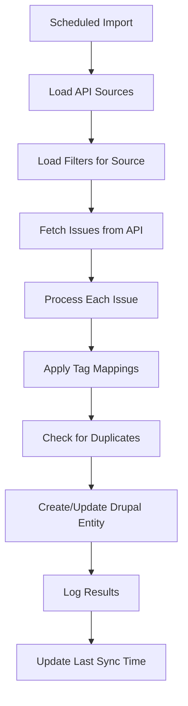

# AI Dashboard Module - Technical Documentation

## Table of Contents
1. [Overview](#overview)
2. [Current Implementation](#current-implementation)
3. [System Architecture](#system-architecture)
4. [Content Types & Data Structure](#content-types--data-structure)
5. [Tag Mapping System](#tag-mapping-system)
6. [Dashboard Views & Controllers](#dashboard-views--controllers)
7. [API Integration Plan](#api-integration-plan)
8. [API Documentation References](#api-documentation-references)
9. [Installation & Configuration](#installation--configuration)
10. [Development & Extensibility](#development--extensibility)

## Overview

The AI Dashboard module provides a comprehensive project management system for tracking AI-related contributions, issues, and resource allocation in Drupal. It integrates with external APIs (drupal.org, GitLab, GitHub) to automatically import and categorize issues using a flexible tag mapping system.

**Key Features:**
- Multi-company contributor tracking (simplified without email)
- Issue management with structured categorization
- Calendar-based resource allocation views
- Flexible tag mapping from external sources
- Administrative interfaces with filtering
- Permission-based edit capabilities
- CSV import system for bulk contributor management
- API import system with intelligent status filtering
- Auto-creation of modules during import process

## Recent Improvements (January 2025)

### Data Simplification
- **Email Field Removal**: Removed email from contributor profiles to focus on essential information (full name, drupal.org username, company, role, skills, commitment)
- **CSV Import Streamlined**: Updated CSV template and import process to match simplified contributor structure
- **Duplicate Detection**: Enhanced duplicate detection using drupal.org username as primary identifier

### Enhanced Import System  
- **Status Filtering**: Added comprehensive status filtering for issue imports with intelligent defaults
  - Pre-selects Active, Needs work, Needs review, RTBC, Patch to be ported, Fixed
  - Excludes Postponed and Closed issues by default
  - Fully customizable via checkboxes
- **Flexible Import Limits**: Made maximum issues field optional - leave empty to import all matching issues
- **Module Auto-Creation**: Automatically creates module nodes during import based on configuration name
- **Real-time Progress**: Import management interface with progress feedback and error reporting

### User Experience Improvements
- **Documentation Accessibility**: Comprehensive documentation available in Admin Tools
- **Form Validation**: Enhanced validation for CSV imports with clear error messages
- **Standard Form Processing**: Improved CSV import reliability using standard Drupal form submission

## Current Implementation

### Implemented Components

#### ✅ Content Types
- **AI Company** (`ai_company`) - Organization management
- **AI Contributor** (`ai_contributor`) - Individual contributor profiles (email removed)
- **AI Module** (`ai_module`) - Project/module tracking (auto-created during import)
- **AI Issue** (`ai_issue`) - Issue tracking with categorization
- **AI Import Configuration** (`ai_import_config`) - API import configuration with status filtering
- **AI Resource Allocation** (`ai_resource_allocation`) - Time tracking
- **AI Tag Mapping** (`ai_tag_mapping`) - External tag categorization

#### ✅ Dashboard Views
- **Main Dashboard** (`/ai-dashboard`) - Company overview with contributors and issues
- **Calendar View** (`/ai-dashboard/calendar`) - Weekly resource allocation view
- **Administrative Views** with filtering:
  - Contributors (`/ai-dashboard/admin/contributors`)
  - Issues (`/ai-dashboard/admin/issues`) 
  - Import Management (`/ai-dashboard/admin/import`) - Configure and run imports with status filtering
  - Tag Mappings (`/ai-dashboard/admin/tag-mappings`)
  - Documentation (`/ai-dashboard/admin/documentation`) - Comprehensive system documentation

#### ✅ Tag Mapping System
- Flexible mapping of flat tags to structured categories
- Support for multiple mapping types (category, month, priority, status, module, custom)
- Cached service for performance (`TagMappingService`)
- Administrative interface for managing mappings

#### ✅ Import Systems
- **CSV Import** (`/ai-dashboard/admin/contributors/import`) - Bulk contributor import with template download
  - Required fields: full_name, drupal_username (email removed)
  - Auto-creates companies if they don't exist
  - Duplicate detection via drupal_username
  - Validation and error reporting
- **API Import** - Automated issue import from external APIs with status filtering
  - Drupal.org integration with comprehensive status filtering
  - Auto-creates module options during import
  - Configurable import limits (optional)
  - Real-time import execution with progress feedback

#### ✅ User Interface Features
- Permission-based edit links throughout interface
- Full-width layout override for dashboard views
- Responsive design with company logos and avatars
- Complete form displays for all content types

## System Architecture

### Module Structure
```
ai_dashboard/
├── src/
│   ├── Controller/
│   │   ├── AiDashboardController.php    # Main dashboard logic
│   │   └── CalendarController.php       # Calendar view logic
│   ├── Service/
│   │   └── TagMappingService.php        # Tag mapping service
│   └── Commands/
│       └── AiDashboardCommands.php      # Drush commands
├── config/install/                      # Content type & field configs
├── templates/
│   └── ai-calendar-dashboard.html.twig  # Calendar template
├── css/
│   └── calendar-dashboard.css           # Dashboard styling
└── ai_dashboard.routing.yml             # Route definitions
```

### Service Architecture
- **TagMappingService**: Cached service for mapping external tags to structured data
- **Entity Type Manager**: Standard Drupal entity management
- **Controllers**: Route handling and data aggregation
- **Views Integration**: Administrative interfaces with exposed filters

## Content Types & Data Structure

### AI Company (`ai_company`)
**Purpose**: Manage organizations contributing to AI projects
**Fields:**
- Title (Company Name)
- `field_company_size`: Company size category
- `field_company_website`: Company website URL
- `field_company_logo`: Company logo image
- `field_company_color`: Brand color for dashboard

### AI Contributor (`ai_contributor`)
**Purpose**: Individual contributor profiles with company associations
**Fields:**
- Title (Full Name)
- `field_drupal_username`: Drupal.org username (required, used for duplicate detection)
- `field_contributor_company`: Reference to AI Company
- `field_contributor_role`: Job title/role
- `field_contributor_skills`: Multiple skills (unlimited values)
- `field_weekly_commitment`: Days per week commitment
- `field_contributor_avatar`: Profile image

**Note**: Email field was removed from contributors to simplify data collection and focus on essential information.

### AI Issue (`ai_issue`)
**Purpose**: Issue tracking with structured categorization
**Fields:**
- Title (Issue title)
- `field_issue_number`: External issue number (drupal.org nid, GitLab iid)
- `field_issue_url`: Link to external issue
- `field_issue_module`: Reference to AI Module (auto-created during import)
- `field_issue_status`: Status (active, needs_review, needs_work, rtbc, fixed, closed)
- `field_issue_priority`: Priority (critical, major, normal, minor, trivial)
- `field_issue_category`: Structured category (ai_integration, provider_integration, etc.)
- `field_issue_assignees`: Multiple references to contributors
- `field_issue_do_assignee`: Drupal.org assignee username
- `field_issue_deadline`: Due date
- `field_issue_tags`: Original tags from external source (unlimited values)

**Module Auto-Creation**: The `field_issue_module` automatically creates new AI Module nodes during import based on the import configuration name, eliminating the need for manual module setup.

### AI Import Configuration (`ai_import_config`)
**Purpose**: Configure automated imports from external APIs
**Fields:**
- Title (Configuration name, e.g., "AI Module Import Configuration")
- `field_import_source_type`: API source (drupal_org, gitlab, github)
- `field_import_project_id`: External project ID (e.g., drupal.org project nid)
- `field_import_filter_tags`: Comma-separated tags to filter by
- `field_import_status_filter`: Multiple selection of issue statuses to import
- `field_import_max_issues`: Maximum number of issues to import (optional)
- `field_import_date_filter`: Date filter for issue creation
- `field_import_active`: Enable/disable this import configuration

**Status Filtering**: Pre-configured with sensible defaults (Active, Needs work, Needs review, RTBC, Patch to be ported, Fixed) while excluding Postponed and Closed issues. Fully customizable via checkboxes.

**Flexible Limits**: Maximum issues field is optional - leave empty to import all matching issues, or set a specific number for testing/limiting imports.

### AI Tag Mapping (`ai_tag_mapping`)
**Purpose**: Map external flat tags to structured dashboard categories
**Fields:**
- Title (Mapping description)
- `field_source_tag`: Original tag from external source
- `field_mapping_type`: Mapping category (category, month, priority, status, module, custom)
- `field_mapped_value`: Structured value for dashboard

## Tag Mapping System

### Architecture
The tag mapping system allows flexible categorization of flat tags from external sources (drupal.org, GitLab, etc.) into structured dashboard data.

### TagMappingService API
```php
// Get the service
$tag_mapping_service = \Drupal::service('ai_dashboard.tag_mapping');

// Map single tag
$category = $tag_mapping_service->mapTag('AI Logging', 'category');
// Returns: 'ai_integration'

// Process multiple tags
$tags = ['AI Logging', 'June', 'Critical'];
$processed = $tag_mapping_service->processTags($tags);
// Returns:
// [
//   'category' => 'ai_integration',
//   'month' => '2024-06',
//   'priority' => 'critical',
//   'status' => null,
//   'module' => null,
//   'custom' => []
// ]
```

### Mapping Types
- **category**: Issue categories (ai_integration, provider_integration, content_generation, etc.)
- **month**: Time-based categorization (2024-06, 2024-07)
- **priority**: Issue priorities (critical, major, normal, minor, trivial)
- **status**: Issue statuses (active, needs_review, fixed, etc.)
- **module**: Module/component mappings (ai, ai_provider_openai, etc.)
- **custom**: Any other categorization needs

### Caching Strategy
- Mappings cached for 1 hour for performance
- Cache automatically cleared when mappings are modified
- Manual cache clearing available via service method

## Dashboard Views & Controllers

### Main Dashboard (`AiDashboardController::main()`)
**Route**: `/ai-dashboard`
**Purpose**: Company-centric overview showing contributors and their current issues
**Data Flow**:
1. Load all companies with contributors
2. For each contributor, get assigned active issues
3. Aggregate issue counts and display in structured layout
4. Include edit links for admin users

### Calendar View (`CalendarController::calendarView()`)
**Route**: `/ai-dashboard/calendar` 
**Purpose**: Weekly resource allocation view
**Features**:
- Week navigation with offset parameters
- Company/contributor grouping
- Issue assignment visualization
- Weekly commitment tracking
- Real-time edit capabilities for admins

### Administrative Views
Built using Drupal Views with exposed filters:
- **Contributors Admin**: Filter by company and skills
- **Issues Admin**: Filter by category, status, priority
- **Tag Mappings Admin**: Filter by mapping type

## API Integration Plan

### Supported APIs

#### Drupal.org REST API
**Base URL**: `https://www.drupal.org/api-d7/`
**Documentation**: https://www.drupal.org/drupalorg/docs/apis

**Key Endpoints**:
```
# Get project issues
GET /node.json?type=project_issue&field_project={PROJECT_NID}

# Filter parameters
&field_issue_status=1,13,8,14,15,2   # Status IDs (Active, Needs work, Needs review, RTBC, Patch to be ported, Fixed)
&taxonomy_vocabulary_9={TAG_IDS}     # Issue tags
&field_issue_priority={PRIORITY}     # Priority level
&sort=created&direction=DESC          # Sort by creation date
&limit={MAX_ISSUES}                   # Maximum issues to fetch (default 1000 if not specified)
```

**Status ID Reference**:
- `1` - Active
- `13` - Needs work  
- `8` - Needs review
- `14` - Reviewed & tested by the community (RTBC)
- `15` - Patch (to be ported)
- `2` - Fixed
- `4` - Postponed (excluded by default)
- `16` - Postponed (maintainer needs more info) (excluded by default)
- `6` - Closed (duplicate) (excluded by default)
- `5` - Closed (won't fix) (excluded by default)
- `18` - Closed (works as designed) (excluded by default)
- `7` - Closed (outdated) (excluded by default)
- `3` - Closed (fixed) (excluded by default)

**Example Request**:
```bash
curl "https://www.drupal.org/api-d7/node.json?type=project_issue&field_project=3346420&field_issue_status=1,13,8,14,15,2&sort=created&direction=DESC&limit=1000"
```

#### GitLab API
**Base URL**: `https://gitlab.com/api/v4/`
**Documentation**: https://docs.gitlab.com/ee/api/issues.html

**Key Endpoints**:
```
# Get project issues  
GET /projects/{id}/issues

# Filter parameters
?state=opened                         # Issue state
&labels=ai,core,enhancement          # Labels (tags)
&assignee_id={USER_ID}               # Assigned user
&milestone={MILESTONE_ID}            # Milestone
&sort=updated_desc                   # Sort order
```

**Example Request**:
```bash
curl --header "PRIVATE-TOKEN: your_token" \
  "https://gitlab.com/api/v4/projects/123/issues?state=opened&labels=ai,core"
```

#### GitHub API  
**Base URL**: `https://api.github.com/`
**Documentation**: https://docs.github.com/en/rest/issues/issues

**Key Endpoints**:
```
# Get repository issues
GET /repos/{owner}/{repo}/issues

# Filter parameters
?state=open                          # Issue state
&labels=ai,enhancement               # Labels (tags)  
&assignee={USERNAME}                 # Assigned user
&milestone={MILESTONE_NUMBER}        # Milestone
&sort=updated&direction=desc         # Sort order
```

### Configuration System Architecture

#### API Source Configuration
```php
// Content type: ai_api_source
fields:
  - source_type: [drupal_org, gitlab, github]
  - api_endpoint: URL
  - authentication: Encrypted API key/token
  - project_id: External project identifier  
  - sync_frequency: [hourly, daily, weekly]
  - active: Boolean
  - last_sync: Timestamp
```

#### Import Filter Configuration  
```php
// Content type: ai_import_filter  
fields:
  - filter_name: Human readable name
  - api_source: Reference to ai_api_source
  - filter_type: [tag, status, priority, assignee, date_range]
  - filter_operator: [contains, equals, in, not_in]
  - filter_values: Comma-separated values
  - active: Boolean
```

### Import Process Flow


### Field Mapping System
```yaml
# Configuration mapping API fields to Drupal fields
drupal_org_mapping:
  title: 'title'
  field_issue_number: 'nid'
  field_issue_url: 'url'
  field_issue_status: 'field_issue_status'
  field_issue_priority: 'field_issue_priority'
  field_issue_tags: 'taxonomy_vocabulary_9'
  created: 'created'
  changed: 'changed'

gitlab_mapping:
  title: 'title'
  field_issue_number: 'iid'
  field_issue_url: 'web_url'
  field_issue_status: 'state'
  field_issue_tags: 'labels'
  created: 'created_at'
  changed: 'updated_at'
```

## API Documentation References

### Drupal.org API
- **Main API Documentation**: https://www.drupal.org/drupalorg/docs/apis
- **REST API Endpoints**: https://www.drupal.org/api-d7/
- **Issue Queue API**: https://www.drupal.org/drupalorg/docs/apis/rest-and-other-apis
- **Authentication**: https://www.drupal.org/drupalorg/docs/apis/authentication

**Key Data Structures**:
```json
{
  "nid": "3412340",
  "title": "Add OpenAI GPT-4 support",
  "field_issue_status": "1",
  "field_issue_priority": "300",
  "taxonomy_vocabulary_9": [
    {"id": "9", "name": "AI Core"},
    {"id": "27", "name": "June"}
  ],
  "field_project": {"id": "3294612", "name": "AI"}
}
```

### GitLab API
- **Issues API**: https://docs.gitlab.com/ee/api/issues.html
- **Projects API**: https://docs.gitlab.com/ee/api/projects.html
- **Authentication**: https://docs.gitlab.com/ee/api/#authentication
- **Rate Limiting**: https://docs.gitlab.com/ee/api/#rate-limiting

**Key Data Structures**:
```json
{
  "id": 76,
  "iid": 6,
  "title": "Add OpenAI GPT-4 support",
  "state": "opened",
  "labels": ["AI Core", "enhancement", "June"],
  "assignees": [{"username": "john_doe"}],
  "web_url": "https://gitlab.com/project/-/issues/6"
}
```

### GitHub API
- **Issues API**: https://docs.github.com/en/rest/issues/issues
- **Authentication**: https://docs.github.com/en/rest/authentication
- **Rate Limiting**: https://docs.github.com/en/rest/rate-limit

**Key Data Structures**:
```json
{
  "id": 1,
  "number": 1347,
  "title": "Add OpenAI GPT-4 support", 
  "state": "open",
  "labels": [{"name": "AI Core"}, {"name": "enhancement"}],
  "assignees": [{"login": "john_doe"}],
  "html_url": "https://github.com/owner/repo/issues/1347"
}
```

## Installation & Configuration

### Requirements
- Drupal 11.x
- PHP 8.1+
- Modules: Views, Entity Reference, Options, Link, Image

### Installation Steps
1. **Enable the module**:
   ```bash
   drush en ai_dashboard
   ```

2. **Import configuration**:
   ```bash
   drush config:import --partial --source=modules/custom/ai_dashboard/config/install
   ```

3. **Set permissions**:
   ```bash
   drush role:perm:add administrator 'access ai dashboard'
   drush role:perm:add administrator 'edit any ai_contributor content'
   drush role:perm:add administrator 'edit any ai_issue content'
   ```

4. **Generate sample data** (optional):
   ```bash
   drush ai-dashboard:generate-dummy
   drush ai-dashboard:generate-tag-mappings
   ```

### Initial Configuration
1. **Create Companies**: Add organizations at `/node/add/ai_company`
2. **Add Contributors**: 
   - Manually create at `/node/add/ai_contributor` 
   - Or use CSV import at `/ai-dashboard/admin/contributors/import`
3. **Configure Import Sources**: Set up import configurations at `/node/add/ai_import_config`
   - Configure status filtering (defaults are optimized)
   - Set project IDs and source types
   - Leave max issues empty to import all
4. **Set up Tag Mappings**: Configure at `/ai-dashboard/admin/tag-mappings`
5. **Run Imports**: Execute imports via `/ai-dashboard/admin/import`

### Permissions
- **Access AI Dashboard**: View dashboard pages
- **Edit AI Content**: Modify contributors, issues, etc.
- **Administer AI Dashboard**: Full administrative access

## Development & Extensibility

### Adding New API Sources
1. **Implement ApiSourceInterface**:
   ```php
   class CustomApiService implements ApiSourceInterface {
     public function authenticate(): bool { }
     public function fetchIssues(array $filters = []): array { }
     public function validateConnection(): bool { }
   }
   ```

2. **Register in services.yml**:
   ```yaml
   ai_dashboard.custom_api:
     class: Drupal\ai_dashboard\Service\CustomApiService
     arguments: ['@http_client', '@config.factory']
   ```

3. **Add field mapping configuration**
4. **Update import service to handle new source type**

### Extending Tag Mapping
The TagMappingService is designed for extensibility:
```php
// Add custom mapping logic
$tag_mapping_service->addCustomProcessor($callable);

// Hook into mapping process
function mymodule_ai_dashboard_tag_process_alter(&$mapped_data, $original_tags) {
  // Custom processing logic
}
```

### Custom Dashboard Views
Create custom controllers extending the base pattern:
```php
class CustomDashboardController extends ControllerBase {
  public function customView() {
    // Build custom dashboard view
    return $build_array;
  }
}
```

### Testing
- **Unit Tests**: Test individual services and utilities
- **Functional Tests**: Test full import workflows
- **Integration Tests**: Test API connectivity and data mapping

### Performance Considerations
- **Caching**: Tag mappings cached for 1 hour
- **Batch Processing**: Large imports processed in batches
- **Queue System**: Background processing for imports
- **Database Indexing**: Optimized queries for dashboard views

---

**Module Version**: 1.0.0  
**Drupal Compatibility**: 11.x  
**Last Updated**: January 2025  
**Maintainer**: AI Dashboard Team

For questions or contributions, see the project repository or contact the development team.